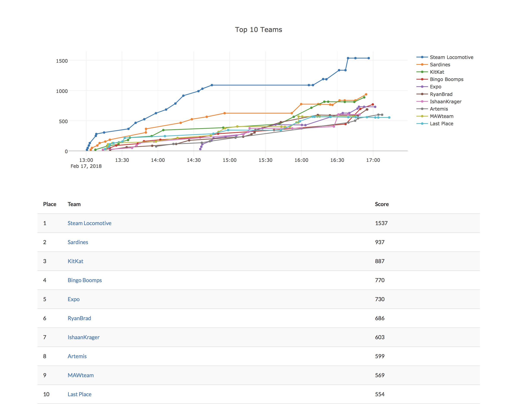
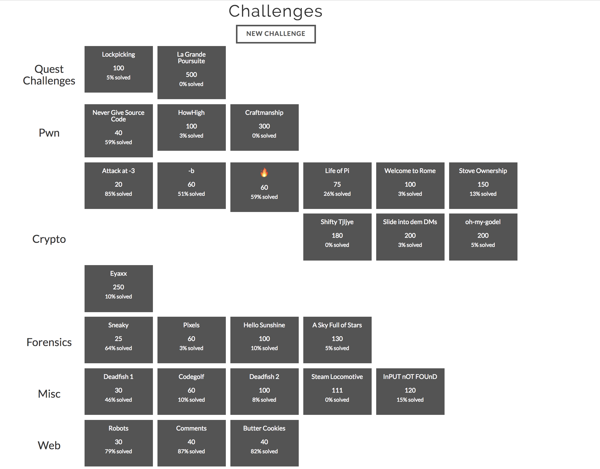

TreeCTF ran as part of [Treehacks 2018](https://treehacks.com) on Feb 17th, 2018. 

## Problems

- [Crypto](/crypto)
  - [Attack at -3](/crypto/caesar1)
- Web
  - p1
  - p2 with links

## Example writeup

# Life of Pi

**Category:** Crypto
**Points:** 75
**Solves:** 
**Description:**

> _problem_info_here_
>
> u
>

## Write-up

(TODO)

## Other write-ups and resources

eu

See [participant data here.](treectf.2018-02-18.zip)
